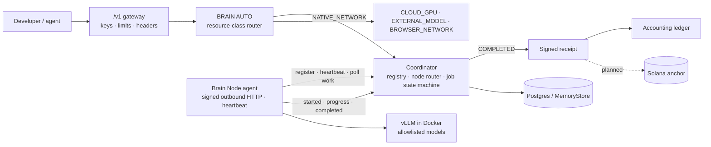

<p align="center">
  <a href="https://brainnetwork.app"></a>
</p>

<p align="center">
  <a href="https://brainnetwork.app/network"></a>
  <a href="https://brainnetwork.app/explorer"></a>
  <a href="https://brainnetwork.app/explorer"></a>
  
  
  <a href="https://x.com/useBrainnetwork"></a>
</p>

<p align="center">
  <a href="https://brainnetwork.app/chat"><b>Use BRAIN</b></a> ·
  <a href="https://brainnetwork.app/earn"><b>Power BRAIN</b></a> ·
  <a href="https://docs.brainnetwork.app">Docs</a> ·
  <a href="https://brainnetwork.app/developers">API</a> ·
  <a href="https://brainnetwork.app/pricing">Pricing</a> ·
  <a href="https://brainnetwork.app/network">Network</a> ·
  <a href="https://brainnetwork.app/economics">Economics</a> ·
  <a href="https://x.com/useBrainnetwork">X</a>
</p>


# BRAIN — The Compute Layer for Autonomous AI

**BRAIN** is a distributed AI compute network. People run **Brain Nodes**; developers and agents send requests through an **OpenAI-compatible API**; a coordinator routes each request to a node, times it, and signs a compute receipt. The same network is also powered by browsers: open a tab and the server measures and verifies your WebGPU compute.

Live at [brainnetwork.app](https://brainnetwork.app). Docs: [docs.brainnetwork.app](https://docs.brainnetwork.app) (the full account of how it works, synced from [`gitbook/`](gitbook/)). Source: [github.com/UseBrainNetwork/brain](https://github.com/UseBrainNetwork/brain). Every figure on the site carries its provenance (LIVE, DEMO or PLANNED); the rules are in [REAL_VS_SIMULATED.md](REAL_VS_SIMULATED.md) and [docs/architecture.md](docs/architecture.md).


## Experimental AMD GPU + Ollama Support (Community Fork)

> **Unofficial community experiment.** This integration is not part of the official BRAIN Network release.

This fork adds experimental support for running a BRAIN node with an **AMD Radeon GPU using Ollama**, without requiring NVIDIA CUDA or vLLM.

**Tested configuration:**
- GPU: AMD Radeon RX 9070 XT (16 GB VRAM)
- Operating system: Windows
- Inference backend: Ollama
- Model: Qwen 2.5 1.5B Instruct
- Coordinator: Local BRAIN development server

**Verified locally:**
- Node successfully registered as `ONLINE`
- Two inference jobs completed through the local coordinator
- Streaming inference and GPU execution tested
- TypeScript checks passed
- 231 automated tests passed, 3 skipped

**Limitations:** Compatibility with the public BRAIN coordinator has not been verified. Public network participation, official support and SOL rewards are **not guaranteed**.

For setup instructions and technical details, see [AMD + Ollama Node Guide](node/OLLAMA-AMD.md).

This work is maintained as an independent community experiment and is not an official BRAIN Network release.

---

## Run a Node

A Brain Node is an outbound-only agent. It generates an ed25519 identity, reports its hardware, heartbeats every 15 s, long-polls for work, and runs allowlisted open-weight models in an isolated vLLM container. It opens no ports.

```bash
git clone https://github.com/UseBrainNetwork/brain && cd brain && npm install

# NVIDIA GPU + Docker: serves the allowlist in node/models.ts through vLLM
# First start pulls the vLLM image (~10 GB) and the model weights; the agent prints progress.
npm run node

# Any machine, no GPU: a labelled mock node that only ever serves brain/mock
BRAIN_NODE_MODE=mock npm run node
```

| Variable | Effect |
| --- | --- |
| `BRAIN_COORDINATOR_URL` | Coordinator to join (default `https://brainnetwork.app`) |
| `BRAIN_NODE_MODE` | `vllm` or `mock` (auto: vllm when `nvidia-smi` is present) |
| `BRAIN_NODE_MODELS` | Comma-separated subset of the allowlist to serve (default: everything the reported VRAM fits) |
| `BRAIN_NODE_REGION` | Operator label shown to developers, e.g. `eu-north` |
| `BRAIN_NODE_CONCURRENCY` | Parallel jobs (1–16) |
| `BRAIN_NODE_ASK_USD_PER_1M` | Optional ask price per 1M tokens; a routing input |
| `BRAIN_NODE_WALLET` | Solana address that gets paid. Then verify it once on `/provider` (sign with that wallet); verified customer inference on the node earns a share of the hourly SOL epochs, claimable on `/rewards`. Unverified: work is recorded, nothing accrues |
| `BRAIN_NODE_HOME` | Where `identity.json` lives (default `~/.brain-node`) |
| `HF_TOKEN` | For gated model repositories |

The node appears on [/network](https://brainnetwork.app/network) within one heartbeat, is benchmarked by the coordinator with a timed job, and shows up on [/provider](https://brainnetwork.app/provider) with its state, load, jobs, uptime, reliability score and ledger earnings. Hardware figures are labelled **reported**; everything else is coordinator-measured.

## Use the API

Change one URL. Run AI on Brain.

```bash
curl https://brainnetwork.app/v1/chat/completions \
  -H "Authorization: Bearer $BRAIN_API_KEY" \
  -H "Content-Type: application/json" \
  -d '{
    "model": "qwen/qwen2.5-7b-instruct",
    "stream": true,
    "messages": [{ "role": "user", "content": "explain entropy in one line" }]
  }'
```

```python
from openai import OpenAI
client = OpenAI(base_url="https://brainnetwork.app/v1", api_key="brain_sk_...")
r = client.chat.completions.create(model="brain/auto", messages=[{"role": "user", "content": "hi"}])
print(r.choices[0].message.content, r.model_extra["brain"]["target"])
```

```js
import OpenAI from "openai";
const client = new OpenAI({ baseURL: "https://brainnetwork.app/v1", apiKey: process.env.BRAIN_API_KEY });
const r = await client.chat.completions.create({ model: "brain/auto", messages: [{ role: "user", content: "hi" }] });
console.log(r.choices[0].message.content);
```

- `model`: a node model id from [/models](https://brainnetwork.app/models) to run on Brain Nodes, or `brain/auto` to let BRAIN AUTO choose across browser compute, Brain Nodes, operator cloud and external models. Optional fields: `mode` (`AUTO` · `CHEAP` · `FAST` · `QUALITY` · `BROWSER_ONLY`), `privacy` (`PUBLIC` · `STANDARD` · `PRIVATE`), `maxCost` (USD), `maxLatency` (ms).
- Response headers: `brain-request-id`, `brain-target`, `brain-latency`, `x-brain-receipt`, and for node work `brain-node-id`, `brain-region`. The `brain` object (and the stream's closing `event: brain`) carries route, model, cost, receipt id, and for node work `brain.node` = `{ id, region, reliability, computeClass, routing, verification }`.
- Node models run on hardware BRAIN does not operate, so they are `privacy: public`; a `standard` or `private` request pinned to a node model returns `400 privacy_conflict` instead of being routed somewhere else.
- If nothing can run the request you get `503` with every target's exclusion reason. BRAIN never answers from a target it did not select.

Keys: [Account → API keys](https://brainnetwork.app/account). Full reference: [/developers](https://brainnetwork.app/developers).

## How Routing Works

Two routers, both deterministic and both explained on the receipt.

**BRAIN AUTO** (`engine/router.ts`) picks a resource class: hard filters for capability, privacy and budget, then a weighted score over cost, latency, reliability and quality. Unknown values stay UNKNOWN and are penalised, never guessed. Weights per mode: [ROUTING.md](ROUTING.md).

**Node router** (`services/router/score.ts`) picks a Brain Node for a job:

```
eligible  = ONLINE or BUSY with a free slot, serves the model, reported VRAM ≥ requirement,
            region match when required, ask ≤ budget when set
score     = 0.30·capability + 0.25·availability + 0.15·latency + 0.20·reputation + 0.10·price
```

Capability, latency and reputation come only from coordinator measurements (tok/s, heartbeat round trip, completion rate, uptime). Unmeasured inputs score 0.5 with a note. Ties break on node id so the same registry always gives the same answer. When no node is eligible the error names each node and its reason, for example `0 of 3 nodes can serve qwen/qwen2.5-7b-instruct right now (N-3A4F…: VRAM 8 GB < 20 GB required; N-9B12…: offline)`.

## How Compute Is Verified

Contributors are adversarial. The server does not trust any client-reported GPU model, compute units, job completion, benchmark score or uptime.

| Work | Verification | Label on receipt |
| --- | --- | --- |
| Browser WebGPU jobs | Server-seeded challenges, secret spot-checks recomputed on the server, canaries, plausibility bounds; integer kernels, bit-exact | `spot-check` / `canary`, `verified: true` |
| Brain Node inference | Response hash matches text received, streamed text equals final text, token count plausible for the output, wall time on the coordinator's clock. Plus unpaid probes: 5% of deterministic jobs are re-run on a second node and compared; canaries with checkable answers run hourly and after every 25 jobs, two failures = `DEGRADED` | `node-reported`, `verified: false`; probe results on the job and in `brain.node.verification` |
| Upstream providers | None beyond transport | `unverified-provider-response`, `verified: false` |

Benchmarks are coordinator-issued, pinned jobs timed on the coordinator's clock; the compute class (`EDGE` · `CONSUMER` · `PRO` · `DATACENTER`) follows from measured decode speed, never from the GPU name. The **Brain Reliability Score** (0–100) is computed from recorded outcomes, belongs to the node id and feeds routing.

Every completed job produces a `ComputeReceipt` whose canonical body (`jobId, nodeId, model, inputTokens, outputTokens, executionMs, timestamp, requestHash, responseHash, hardwareClass, cost`) is hashed and signed with the coordinator's ed25519 key. Verify any receipt against `GET /api/coordinator/signer`. Zero verified compute always produces zero reward: benchmark jobs issue no receipt, and the ledger accrues only from receipts. Redundant execution and on-chain anchoring of receipt batches are planned and labelled as such.

## Architecture



Job states: `QUEUED → MATCHING → ASSIGNED → STARTING → RUNNING → VERIFYING → COMPLETED`, plus `FAILED` and `CANCELLED`; every transition is recorded with a timestamp and shown on `/network`. Node states: `ONLINE · BUSY · DRAINING · DEGRADED · OFFLINE`, derived server-side (offline after 45 s without a heartbeat; its jobs are re-queued).

Component-by-component description with LIVE / DEMO / PLANNED labels: [docs/architecture.md](docs/architecture.md).

## Local Development

One command, the whole flow:

```bash
docker compose up            # Postgres + web (gateway, coordinator, frontend) + a mock Brain Node
npm run demo:request         # sends a request, prints the answer, route, job timeline, receipt hash + signature
```

Without Docker:

```bash
npm install
npm run dev                  # http://localhost:3000, in-memory store, BRAIN_OPEN_V1=1 for a keyless local API
npm run node:mock            # a mock Brain Node joining localhost
npm run demo:request
npm test                     # 183 tests: routing, job transitions, node auth and replay, heartbeat/offline, receipts, benchmarks
npm run typecheck && npm run build
```

Node 20+. With no configuration the app runs on an in-memory store and the inference API returns an honest `503` until a node joins or a provider is configured. Copy `.env.example` to `.env.local` for providers, prices or Postgres.

<details id="environment">
<summary><b>Environment</b></summary>

| Variable | Effect |
| --- | --- |
| `BRAIN_EXTERNAL_BASE_URL` / `_API_KEY` / `_MODEL` | OpenAI-compatible external provider (`EXTERNAL_MODEL`) |
| `BRAIN_FALLBACK_BASE_URL` / `_API_KEY` / `_MODEL` | Operator cloud (`CLOUD_GPU`), e.g. vLLM |
| `BRAIN_EXTERNAL_QUALITY_TIER` / `BRAIN_FALLBACK_QUALITY_TIER` | Operator-assigned 0..1 tier used by `QUALITY` mode. Unset = UNKNOWN |
| `BRAIN_API_KEYS` | Extra operator keys accepted on `/v1/*`. Self-serve keys come from `/account`; `/v1` is never open without a key (`BRAIN_OPEN_V1=1` for a local demo only) |
| `DATABASE_URL` (or `POSTGRES_URL`) | Postgres instead of the in-memory store; schema self-applied; advisory-locked job updates |
| `BRAIN_PRICE_USD_PER_1K_COMPUTE_UNITS` | List price for browser compute. Unset = receipts carry `UNKNOWN` cost |
| `BRAIN_PRICE_USD_PER_1M_TOKENS` / `BRAIN_FALLBACK_PRICE_USD_PER_1M` / `BRAIN_EXTERNAL_PRICE_USD_PER_1M` | Chat list price and each upstream's cost. Unset = `UNKNOWN`, never estimated |
| `BRAIN_EXTERNAL_EMBED_MODEL` | Enables `/v1/embeddings` passthrough |
| `BRAIN_CREDIT_USD`, `BRAIN_PLAN_FREE_CREDITS`, `BRAIN_PLAN_PRO_USD` / `_CREDITS`, `BRAIN_PLAN_MAX_USD` / `_CREDITS` | Credit value and plan allowances |
| `SOLANA_RPC_URL` + `BRAIN_TOKEN_MINT` | Real SPL holdings lookup. The protocol-wallet read falls back to the public RPC when unset |
| `BRAIN_SERVER_SECRET` | HMAC key for sessions and claims. Required in production |
| `BRAIN_RELAY_URL` + `BRAIN_RELAY_SECRET` | The inference relay (`relay/`, a Cloudflare Worker: `cd relay && npx wrangler deploy && npx wrangler secret put RELAY_SECRET`, same value as `BRAIN_RELAY_SECRET`). Unset = NETWORK chat reports no capacity |
| `BRAIN_ADMIN_TOKEN` · `BRAIN_DEMO_TOKEN` | Operator routes · optional gate on console job/order creation |
| `BRAIN_PAYOUTS_ENABLED` + `BRAIN_PAYOUT_SECRET_KEY` | SOL claim payouts. Off by default |
| `BRAIN_PAYOUTS_OPEN_AT` | Optional opening time (ISO-8601 or epoch ms); claims refused before it, open automatically after |
| `BRAIN_EPOCH_MINUTES` | Epoch length (default 1440). Closed epochs with work settle automatically on the next dashboard read or cron run |
| `BRAIN_EPOCH_POOL_SOL` | Fixed SOL pool per epoch, split by verified compute among linked wallets. Unset = nothing settles as live. The payout wallet must be funded to cover it; `/economics` shows the runway read from chain |
| `NEXT_PUBLIC_BRAIN_WS_URL` | External WebSocket event bus (default: built-in SSE) |
| `NEXT_PUBLIC_PRIVY_APP_ID` | Privy app ID (public). Wallet login runs through Privy (Solana browser wallets or email → embedded Solana wallet); ownership is still proven by a signed server nonce. Unset = built-in wallet picker |

Exercise the inference path without a real provider:

```bash
node scripts/mock-upstream.mjs 3999
BRAIN_EXTERNAL_BASE_URL=http://localhost:3999/v1 BRAIN_EXTERNAL_API_KEY=test BRAIN_EXTERNAL_MODEL=mock npm run dev
```

Run network inference locally (relay on :8787, app on :3000, then open `/node?autostart=1` in four or more WebGPU browsers):

```bash
echo "RELAY_SECRET=$(openssl rand -hex 32)" > relay/.dev.vars          # local relay secret
(cd relay && npx wrangler dev --port 8787)                              # the relay
BRAIN_RELAY_URL=http://127.0.0.1:8787 BRAIN_RELAY_SECRET=<same value> npm run dev
```

`/dev/llm-check?model=qwen3-1.7b&layers=4` compares the GPU kernels against the CPU reference on real weights.

</details>

## Repository

```
app/          Next.js routes (pages + /api handlers)
components/   UI by page; components/ui.tsx holds primitives
domain/       Shared types: ExecutionRequest, ExecutionEstimate, ComputeReceipt, ComputeNode, …
engine/       BRAIN AUTO: providers, router, plan, orders (streaming + fallback), learning
api/          Gateway (validation, reframed streams, API keys), chat event stream
services/     Server: nodes, distributed jobs, verification, reputation, receipts, accounting,
              accounts, credits, capability, store (memory | Postgres), event bus, mock/
webgpu/       Browser: device detection, WGSL kernels (matmul, Q4_0/Q8_0 LLM stage), ComputeBackend, benchmark
inference/    Network LLM inference: GGUF loader, Qwen3 config + stage plan, tokenizer, CPU reference, wire protocol
relay/        Cloudflare Worker + Durable Object that moves hidden states node → node (deployed separately)
network/      Deterministic workloads, contributor engine (jobs + inference stage), realtime sources
rewards/      Reward formula and engine, config, simulator
providers/    OpenAI-compatible upstream client
lib/          Non-secret config, plans, pricing, formatting, wallet adapters
db/           Postgres schema (self-applied on first connection)
scripts/      Headless-Chrome e2e with real WebGPU, screenshots, mock upstream
```

<details>
<summary><b>Pages</b></summary>

| Route | What it is |
| --- | --- |
| `/` | Use BRAIN / Power BRAIN, live metrics strip, resource classes, network panel |
| `/chat` | Streaming chat through BRAIN AUTO; "Powered by BRAIN" expands to route, model, nodes, cost, latency, verification, receipt |
| `/pricing` · `/account` | Plans and credits; your plan, usage, compute earnings, net, credit ledger |
| `/earn` · `/node` · `/demo` | Contributor flow, full-screen worker, multi-device room |
| `/developers` | Quickstart (Python / JS / cURL), request path, routing, response format, node protocol, verification |
| `/auto` | Routing console: every resource class estimated for one request, decision, receipt |
| `/network` · `/explorer` · `/capacity` · `/economics` | Operations, jobs and nodes, what can run today, where the money goes |
| `/receipt/[id]` · `/node/[id]` · `/epoch/[id]` | Proof-of-compute receipt, node reputation, immutable reward epoch |
| `/rewards` · `/brain` | Reward formula and claims; the network as one machine |

</details>

## Security

- Nothing client-reported is trusted; reported and measured values are stored and labelled separately.
- Node requests are ed25519-signed over method, path, timestamp and body hash; ids derive from keys; replays and stale timestamps are refused.
- Nodes run only the allowlist, in Docker with dropped capabilities, loopback-only, outbound-only.
- Public endpoints and the event stream carry no prompts, outputs, IPs, wallets or keys.
- Secrets live in server env only. Keys and tokens are stored as hashes. The receipt signing key is never served; only its public half is.

Threat model, residual risks and planned controls: [docs/security.md](docs/security.md). Report a vulnerability: [SECURITY.md](SECURITY.md).

## Roadmap

| | Status |
| --- | --- |
| Node agent, coordinator, node router, job state machine, OpenAI API, signed receipts, ledger, `/network` `/provider` `/models`, Docker Compose | **Shipped** |
| vLLM backend on real NVIDIA hardware in CI | Shipped in code, not yet exercised by CI |
| Persistent WebSocket transport (QUIC-ready interface) | Planned — V1 is HTTP long-poll because the coordinator runs serverless |
| Sampled redundant execution and canary prompts for node inference | **Shipped** (unpaid probes; receipts stay `node-reported`) |
| NVML/DCGM telemetry attestation | Planned |
| Solana receipt anchoring and provider settlement | Planned; the ledger's `settled` is 0 until it runs |
| Multi-node sharding (EXO-style) for models larger than one GPU | Planned |

## Principles

- Nothing client-reported is trusted. Only server-verified compute earns.
- Unknown is a valid value. Prices, latencies and hardware are measured or configured, never estimated.
- Real and simulated records never share a total. Demo data is labelled DEMO or SIM everywhere it appears.
- No token emissions, staking yield, points, quests, licenses, NFTs, projected returns or "cheaper than X" claims.

## Community

[@useBrainnetwork](https://x.com/useBrainnetwork) on X · [github.com/UseBrainNetwork](https://github.com/UseBrainNetwork)

## License

© Brain Network. All rights reserved.
